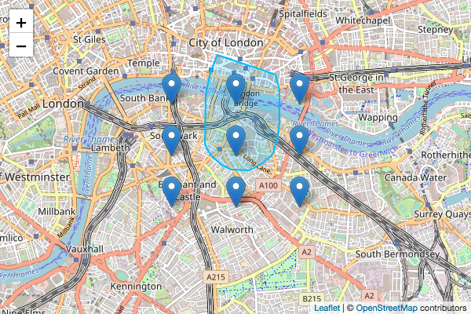

# leaflet-lasso

True lasso selection plugin for Leaflet. [Demo](http://zakjan.github.io/leaflet-lasso/docs/index.html)

## TODO

- support markers hidden by L.MarkerClusterGroup
- support also other layer types, not just markers (with @turf/intersect)
- add L.Control